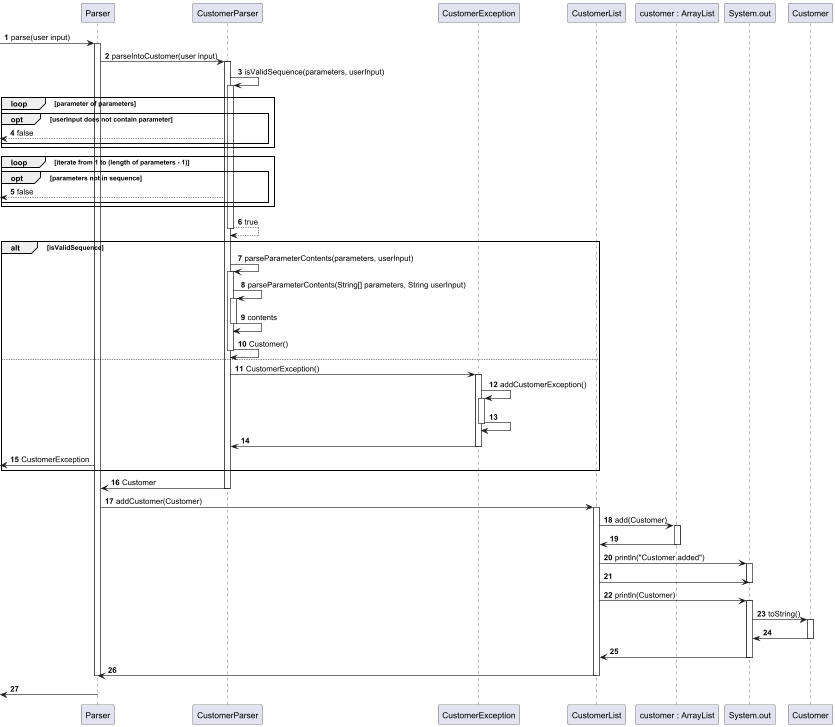
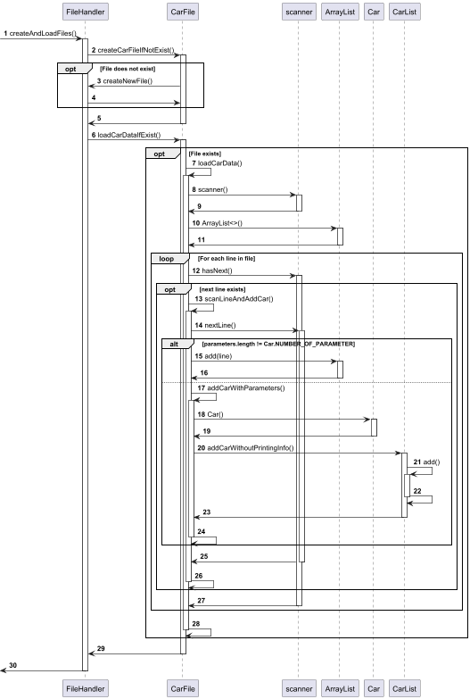

# Developer Guide

## Acknowledgements

{list here sources of all reused/adapted ideas, code, documentation, and third-party libraries -- include links 
to the original source as well}

## Design & implementation

{Describe the design and implementation of the product. Use UML diagrams and short code snippets where applicable.}

### Sequence diagrams

1. `Adding a customer`

The following sequence diagram will explain the sequence of events after the user inputs an add-user command.

2. `Creating Car file and loading file`

The following sequence diagram will explain the sequence of events for loading of the carData.txt which happens at the
start of the program. The carData.txt will be created if it does not exist at the start of program and its data will be
loaded if the file exist.

## Product scope
### Target user profile

Our targeted users are car rental companies which handles rental transaction on a daily basis. More specifically ,
CliRental will be targeted at workers working at the front of house , handling customers 
and recording transactions.

### Value proposition

Our product, CliRental aims to allow quick adding of transactional data when renting out a car in a car rental 
company/store. It also allows for the staff of the rental company to filter through the massive amount of transactions,
finding the transaction they are looking for easily with multiple filters.

## User Stories

|Version| As a ... | I want to ... | So that I can ...|
|--------|----------|---------------|------------------|
|v1.0|new user|see usage instructions|refer to them when I forget how to use the application|
|v2.0|user|find a to-do item by name|locate a to-do without having to go through the entire list|

## Non-Functional Requirements

{Give non-functional requirements}

## Glossary

* *glossary item* - Definition

## Instructions for manual testing

{Give instructions on how to do a manual product testing e.g., how to load sample data to be used for testing}
