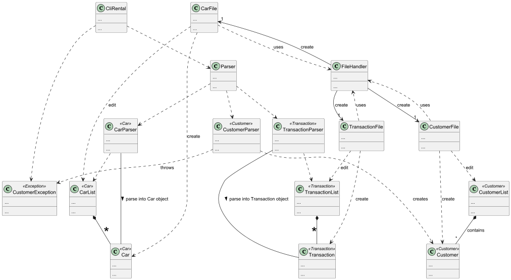
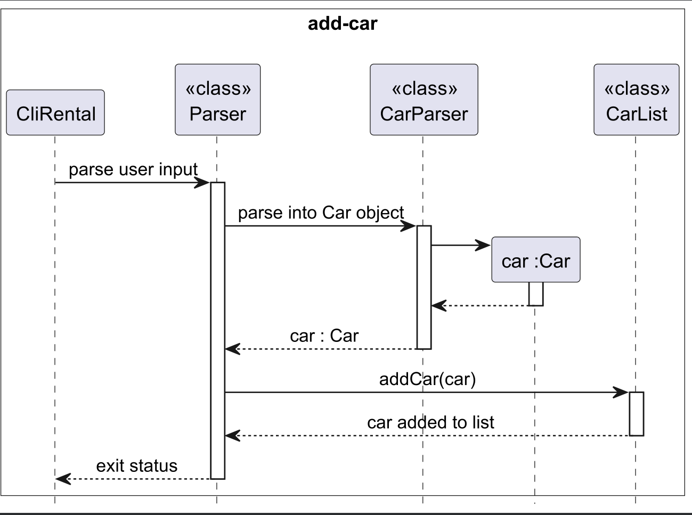
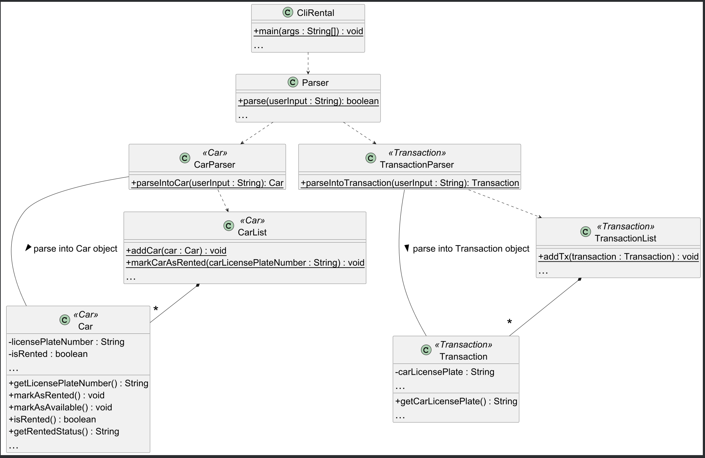

# Developer Guide

## Acknowledgements

No reused/adapted ideas, code, documentation, and third-party libraries was used in the project.

## Design & implementation

The following is our overall class diagram for our whole project. To reduce the size of the overall diagram , only class
names are included

### Sequence diagrams

1. `Adding a customer`

The following sequence diagram will explain the sequence of events after the user inputs an add-user command.

2. `Creating Car file and loading file`

The following sequence diagram will explain the sequence of events for loading of the carData.txt which happens at the
start of the program. The carData.txt will be created if it does not exist at the start of program and its data will be
loaded if the file exist.

### Auto updating of car rental status feature

### Implementation:

Every car added to the car list will have a default rental status of **'Available'**.
Once a valid transaction has been made and added to the transaction list, the particular car,
identified by its **unique identifier (i.e. license plate number)**, will automatically be
marked as **'Rented'**.

Given below is a step-by-step execution of the implementation:

Step 1: The user launches the application and enters the `add-car ...` command to add a new
car to the list, specifying the model name, car license plate number and price of the car.

> **Note**: If the command fails due to invalid parameters or format,
the car will not be added to the list.

The following sequence diagram illustrates a **valid** `add-car` operation:

Step 2: The user enters the `list-cars` command to verify that the car has been successfully added
to the car list.

-> show code output

Example:

Step 3: A customer decides to rent a car from the company. The user then uses the application to track
and record the transaction details. The user executes the `add-tx ...` command to add
a new transaction record, specifying details like the car license plate number.

> **Note**: If the command fails due to invalid parameters or format,
the transaction will not be added to the list and the car rental status remains as **'Available'**.

The following sequence diagram illustrates a **valid** `add-tx` operation:

Step 4: After adding the transaction, the rental status of the selected car will now be updated to **'Rented'**.
The user finally executes the `list-rented` command to list all rented out cars. The car that
was just rented out should appear in the list, together with other rented out cars (if any).

Example:

Step 5: **Optionally**, the user can also execute 
the `list-cars` command to view the rental status of all
the cars. By doing so, the rental status of the car that was just rented out,
should now have a rental status of **'Rented'** instead of **'Available'**.

-> show code output

Example:

> **Note**: The rental status is now updated to **'Rented'**.
> (compare with output in **Step 2**)

The following class diagram shows the interaction between the classes involved:

### Rationale behind way of implementation:
Modelled after the real world, the car is only rented out once the transaction (payment) is complete.
For our application, after adding a transaction, it signifies that the 
transaction was successful and complete. As such, the car should be rented out after that. Therefore, 
the car's rental status is automatically updated once a new transaction record is added.

### Alternatives considered:
- **Alternative 1 (current choice):** Automatically update car rental status
  - Pros: 
    - Improve effectiveness and efficiency (E&E)
    - Easy to implement
    - No need for additional commands
  - Cons: 
    - Does not adhere to software design principles like Single 
Responsibility principle (SRP) or Separation of Concerns principle (SOC).
- **Alternative 2:** Manually update car rental status
  - Pros: 
    - Adheres to the software design principles and makes the code more OOP. 
  - Cons:
    - Possibility that user might forget to update rental status
    - Need to add new commands to update rental status (e.g. `mark-rented`) 

### Implementation of Transaction Completion Management and Retrieval Features

To enhance the functionality of **CliRental**, we have implemented features that allow users to mark transactions as completed or uncompleted, list transactions based on their completion status, and find transactions by customer name. These features streamline the process of managing rental transactions, ensuring accurate tracking and easy retrieval of relevant data.

#### **1. Overview of Features**

- **Marking/Unmarking Transactions as Completed:**
  - **Mark Completed:** Allows users to mark a specific transaction as completed, indicating that the rental process has been finalized.
  - **Unmark Completed:** Enables users to revert a transaction's status from completed to uncompleted if needed.

- **Listing Transactions:**
  - **List Completed Transactions:** Displays all transactions that have been marked as completed.
  - **List Uncompleted Transactions:** Shows all transactions that are still pending completion.

- **Finding Transactions by Customer Name:**
  - Facilitates the retrieval of all transactions associated with a specific customer, enabling efficient management and review.

- **Add Users to the database**
  - Allows transactions involving customers and keep track of user information.

- **Listing Cars and status**
  - Displays all the cars in the company and see if they are rented out or not.

- **File saving**
  - Saves all data regarding transactions, cars and customer preventing data loss.
  - Real-time updates after every command.
  - Loads file upon start of program without any hassle.

#### **2. Design & Implementation**

The implementation of these features is encapsulated within the `TransactionList` class, which manages all transaction-related operations. Below is a detailed breakdown of the design and implementation strategies employed.

##### **a. Class-Level Design**

**`TransactionList` Class:**

- **Responsibilities:**
  - Manage the list of all transactions.
  - Provide functionalities to add, remove, update, and retrieve transactions based on various criteria.

- **Key Methods:**
  - `markCompletedByTxId(String txId)`: Marks a transaction as completed.
  - `unmarkCompletedByTxId(String txId)`: Marks a transaction as uncompleted.
  - `printCompletedTransactions()`: Lists all completed transactions.
  - `printUncompletedTransactions()`: Lists all uncompleted transactions.
  - `findTxsByCustomer(String customer)`: Retrieves transactions associated with a specific customer.

**Design Considerations:**

- **Encapsulation:** The `transactionList` is maintained as a private static `ArrayList<Transaction>`, ensuring controlled access through public methods.
- **Data Integrity:** Assertions and exception handling are employed to maintain the integrity of transaction data during operations.

**`TransactionFile` Class:**

- **Responsibilities:**
  - Loads transaction data from transactionData.txt upon start of program.
  - Updates transaction data in the file after every command.

- **Key Methods:**
  - `loadTransactionData()`: Loads transaction data from transactionData.txt to TransactionList.
  - `scanLineAndAddTransaction()`: Scans the current line in the file and add it into TransactionList.
  - `addTransactionWithParameters` : Create a Transaction object based on a list of parameters.
  - `updateTransactionDataFile()` : Reads TransactionList and update TransactionList.txt accordingly.

- **Design Considerations** 
  - `User Experience` : Users should not need to update the files manually after each command and should be automated 
        instead.
  - `Maintainability` : When new parameters are introduced, only 3 methods and less than 10 lines of code 
      needs to be updated. 

## Product scope
### Target user profile

Our targeted users are car rental companies which handles rental transaction on a daily basis. More specifically ,
CliRental will be targeted at workers working at the front of house , handling customers 
and recording transactions.

### Value proposition

Our product, CliRental aims to allow quick adding of transactional data when renting out a car in a car rental 
company/store. It also allows for the staff of the rental company to filter through the massive amount of transactions,
finding the transaction they are looking for easily with multiple filters.

## User Stories

|Version| As a ... | I want to ... | So that I can ...|
|--------|----------|---------------|------------------|
|v1.0|new user|see usage instructions|refer to them when I forget how to use the application|
|v2.0|user|find a to-do item by name|locate a to-do without having to go through the entire list|

## Non-Functional Requirements

{Give non-functional requirements}

## Glossary

* *glossary item* - Definition

## Instructions for manual testing

1) Download our v2.0 jar file
2) Check out our user guide and experiment away!!
