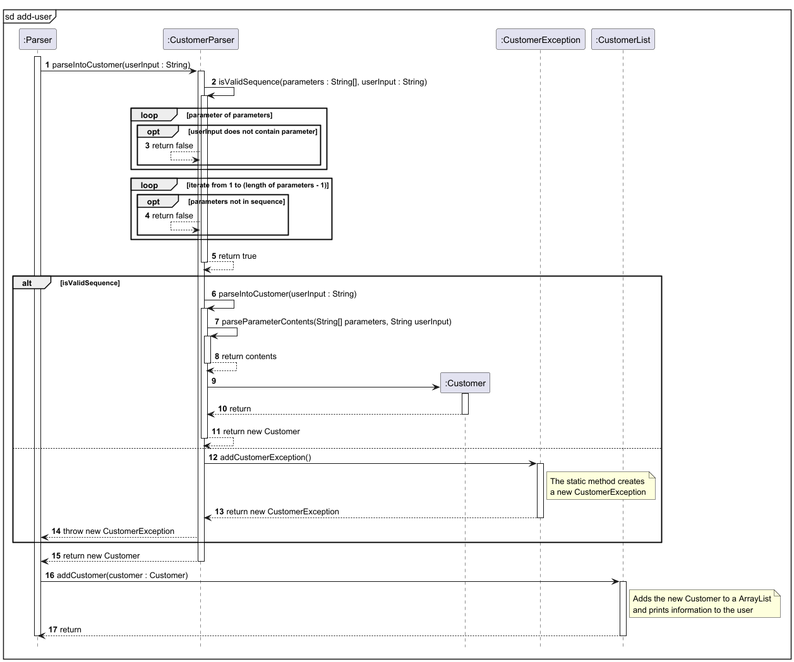
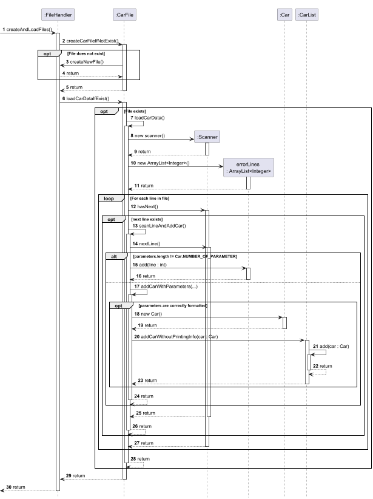
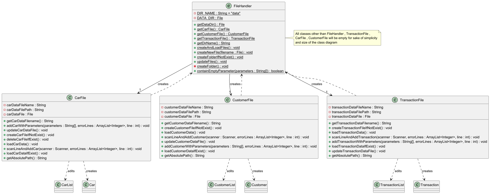
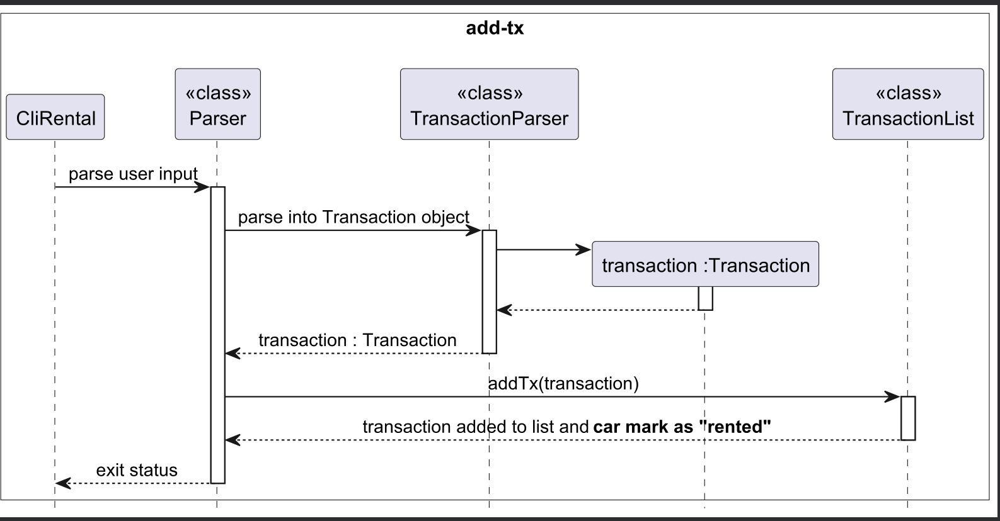

# Developer Guide

## Acknowledgements

No reused/adapted ideas, code, documentation, and third-party libraries was used in the project.

## Limitations of PlantUML

1) Circle with capitalised first letter is shown in class diagram beside the class name e.g. C when class is 
called Customer.
2) Other software might be used by the team if plantUML is unable to display what they want, explaining difference 
in diagrams across the team

## Design & implementation

### Architecture diagram

The following is our overall architecture diagram for our whole project. To reduce the size of the overall diagram , only class
names are included.

---
### Adding a customer

### Implementation:
The following sequence diagram will illustrate the sequence of events of a **valid** `add-user` operation. Customer 
details like age and contact number are stored which are useful when the rental company would like to contact 
the customer and creating transactions.

### Sequence diagram

### Removing a car

The following sequence diagram illustrates the sequence of events after the user executes
the `remove-car` command. 

### Creating Car file and loading file

### High-level steps

1) Parse the input into its parameters and extract the content.
2) Create the new Customer object if all parameters fit the format.
3) Add it to the current Customer ArrayList.

---
### Creating file and loading file at the start of the program

### Implementation:
The following sequence diagram will explain the sequence of events for loading of the carData.txt which happens at the
start of the program. The operations involved for the other two files are very similar so we will use the example of 
carData.txt. The carData.txt will be created if it does not exist at the start of program and its data will be
loaded if the file exist.

### Sequence diagram

### Class diagram for All File-related Classes

### High-level steps 

1) File is created if it does not exist.
2) Each line in the file is scanned and checked that each parameter is correctly formatted.
3) The correct data is parsed into a new Car object.
4) Each Car object is placed into the ArrayList.

### Rationale behind way of implementation:

Similar to real-world applications, data are stored on the computer already and does not require the user to explicitly 
load data from a specific location. It should be automatic and hassle-free. Preventing the corrupted data from entering 
the system is also important as it might crash the program thus it is important to check the data before adding.

### Alternatives considered:
* User can choose which file to load
  * Cons
    1) Too complicated as there are too many possible file paths possible and would significant add to the complexity of 
    the program.
* User can choose whether to load data file and save when they want to.
  * Pros
    1) User has more control over the version control of the data files.
  * Cons
    1) User experience might decrease as they constantly have to save files themselves.
    2) Many important data can be lost if program crashes before saving of file which does not happen with 
     constant updating.
    
---
### Auto updating of car rental status feature

### Implementation:

Every car added to the car list will have a default rental status of **'Available'**.
Once a valid transaction has been made and added to the transaction list, the particular car,
identified by its **unique identifier (i.e. license plate number)**, will automatically be
marked as **'Rented'**.

Given below is a step-by-step execution of the implementation:

Step 1: The user launches the application and enters the `add-car ...` command to add a new
car to the list, specifying the model name, car license plate number and price of the car.

> **Note**: If the command fails due to invalid parameters or format,
the car will not be added to the list.

The following sequence diagram illustrates a **valid** `add-car` operation:

Step 2: The user enters the `list-cars` command to verify that the car has been successfully added
to the car list.

Example:

Step 3: A customer decides to rent a car from the company. The user then uses the application to track
and record the transaction details. The user executes the `add-tx ...` command to add
a new transaction record, specifying details like the car license plate number.

> **Note**: If the command fails due to invalid parameters or format,
the transaction will not be added to the list and the car rental status remains as **'Available'**.

The following sequence diagram illustrates a **valid** `add-tx` operation:

Step 4: After adding the transaction, the rental status of the selected car will now be updated to **'Rented'**.
The user finally executes the `list-rented` command to list all rented out cars. The car that
was just rented out should appear in the list, together with other rented out cars (if any).

Example:

Step 5: **Optionally**, the user can also execute 
the `list-cars` command to view the rental status of all
the cars. By doing so, the rental status of the car that was just rented out,
should now have a rental status of **'Rented'** instead of **'Available'**.

Example:

> **Note**: The rental status is now updated to **'Rented'**.
> (compare with output in **Step 2**)

The following class diagram shows the interaction between the classes involved:

### Rationale behind way of implementation:
Modelled after the real world, the car is only rented out once the transaction (payment) is complete.
For our application, after adding a transaction, it signifies that the 
transaction was successful and complete. As such, the car should be rented out after that. Therefore, 
the car's rental status is automatically updated once a new transaction record is added.

### Alternatives considered:
- **Alternative 1 (current choice):** Automatically update car rental status
  - Pros: 
    - Improve effectiveness and efficiency (E&E)
    - Easy to implement
    - No need for additional commands
  - Cons: 
    - Does not adhere to software design principles like Single 
Responsibility principle (SRP) or Separation of Concerns principle (SOC).
- **Alternative 2:** Manually update car rental status
  - Pros: 
    - Adheres to the software design principles and makes the code more OOP. 
  - Cons:
    - Possibility that user might forget to update rental status
    - Need to add new commands to update rental status (e.g. `mark-rented`) 
---
### Implementation of Transaction Completion Management and Retrieval Features

To enhance the functionality of **CliRental**, we have implemented features that allow users to mark transactions as completed or uncompleted, list transactions based on their completion status, and find transactions by customer name. These features streamline the process of managing rental transactions, ensuring accurate tracking and easy retrieval of relevant data.

#### **1. Overview of Features**

- **Marking/Unmarking Transactions as Completed:**
  - **Mark Completed:** Allows users to mark a specific transaction as completed, indicating that the rental process has been finalized.
  - **Unmark Completed:** Enables users to revert a transaction's status from completed to uncompleted if needed.

- **Listing Transactions:**
  - **List Completed Transactions:** Displays all transactions that have been marked as completed.
  - **List Uncompleted Transactions:** Shows all transactions that are still pending completion.

- **Finding Transactions by Customer Name:**
  - Facilitates the retrieval of all transactions associated with a specific customer, enabling efficient management and review.

- **Add Users to the database**
  - Allows transactions involving customers and keep track of user information.

- **Listing Cars and status**
  - Displays all the cars in the company and see if they are rented out or not.

- **File saving**
  - Saves all data regarding transactions, cars and customer preventing data loss.
  - Real-time updates after every command.
  - Loads file upon start of program without any hassle.

#### **2. Design & Implementation**

The implementation of these features is encapsulated within the `TransactionList` class, which manages all transaction-related operations. Below is a detailed breakdown of the design and implementation strategies employed.

##### **a. Class-Level Design**

**`TransactionList` Class:**

- **Responsibilities:**
  - Manage the list of all transactions.
  - Provide functionalities to add, remove, update, and retrieve transactions based on various criteria.

- **Key Methods:**
  - `markCompletedByTxId(String txId)`: Marks a transaction as completed.
  - `unmarkCompletedByTxId(String txId)`: Marks a transaction as uncompleted.
  - `printCompletedTransactions()`: Lists all completed transactions.
  - `printUncompletedTransactions()`: Lists all uncompleted transactions.
  - `findTxsByCustomer(String customer)`: Retrieves transactions associated with a specific customer.

**Design Considerations:**

- **Encapsulation:** The `transactionList` is maintained as a private static `ArrayList<Transaction>`, ensuring controlled access through public methods.
- **Data Integrity:** Assertions and exception handling are employed to maintain the integrity of transaction data during operations.

**`TransactionFile` Class:**

- **Responsibilities:**
  - Loads transaction data from transactionData.txt upon start of program.
  - Updates transaction data in the file after every command.

- **Key Methods:**
  - `loadTransactionData()`: Loads transaction data from transactionData.txt to TransactionList.
  - `scanLineAndAddTransaction()`: Scans the current line in the file and add it into TransactionList.
  - `addTransactionWithParameters` : Create a Transaction object based on a list of parameters.
  - `updateTransactionDataFile()` : Reads TransactionList and update TransactionList.txt accordingly.

- **Design Considerations** 
  - `User Experience` : Users should not need to update the files manually after each command and should be automated 
        instead.
  - `Maintainability` : When new parameters are introduced, only 3 methods and less than 10 lines of code 
      needs to be updated. 

---
## Product scope
### Target user profile

Our targeted users are car rental companies which handles rental transaction on a daily basis. More specifically ,
CliRental will be targeted at workers working at the front of house , handling customers 
and recording transactions.

### Value proposition

Our product, CliRental aims to allow quick adding of transactional data when renting out a car in a car rental 
company/store. It also allows for the staff of the rental company to filter through the massive amount of transactions,
finding the transaction they are looking for easily with multiple filters.

## User Stories

| Version     | As a ...                       | I want to ...                                                  | So that I can ...                                          |
|-------------|--------------------------------|----------------------------------------------------------------|------------------------------------------------------------|
| v1.0        | car rental front-desk employee | know the status of all the cars                                | inform customers about availability                        |
| v1.0        | car rental front-desk employee | add customer details to our database                           | keep records for future transactions                       |
| v1.0        | car rental company manager     | get an overview of all transactions                            | gauge how well the company is doing                        |
| v1.0        | car rental front-desk employee | add a new transaction record to the database                   | keep track of transaction details                          |
| v1.0        | car rental front-desk employee | add new cars to the car database                               | have a wider range of cars to offer to customers           |
| v2.0 & v2.1 | car rental front-desk employee | save all my data                                               | ensure information will never be lost                      |
| v2.0 & v2.1 | forgetful car rental employee  | view a help page containing all the commands                   | refer to it whenever I forget any commands                 |
| v2.0 & v2.1 | car rental administrator       | search for all past transactions involving a specific customer | assess their rental history                                |
| v2.0 & v2.1 | car rental administrator       | list all uncompleted transactions                              | follow up on active rentals                                |
| v2.0 & v2.1 | car rental administrator       | list all completed transactions                                | review records of all past rentals                         |
| v2.0 & v2.1 | car rental administrator       | remove all customers or transactions                           | clear out old data when no longer needed                   |
| v2.0 & v2.1 | car rental administrator       | remove individual transactions                                 | remove any unnecessary records individually                |
| v2.0 & v2.1 | car rental company manager     | list out all past and completed transactions                   | gauge how well the company is doing                        |
| v2.0 & v2.1 | car rental fleet manager       | make changes to the car fleet                                  | add or remove cars from the inventory                      |
| v2.0 & v2.1 | car rental fleet manager       | categorize cars by their price range                           | allow customers to choose based on budget                  |
| v2.0 & v2.1 | car rental fleet manager       | add a new car to the list of available cars                    | provide customers with a wider selection                   |
| v2.0 & v2.1 | car rental fleet manager       | list all available cars                                        | quickly check which cars can be rented                     |
| v2.0 & v2.1 | car rental fleet manager       | list all rented-out cars                                       | view which cars are currently in use                       |
| v2.0 & v2.1 | car rental fleet manager       | set a rental duration for each transaction                     | clarify each rental's timeline                             |
| v2.0 & v2.1 | car rental fleet manager       | add or remove cars to match demand                             | manage the car inventory efficiently                       |
| v2.0 & v2.1 | car rental front-desk employee | complete transactions after the customer returns the car       | finalize each rental transaction                           |
| v2.0 & v2.1 | car rental front-desk employee | save customer information                                      | reuse information for returning customers without re-entry |
| v2.0 & v2.1 | car rental front-desk employee | add a new transaction record to the database                   | keep track of transaction details                          |
| v2.0 & v2.1 | car rental front-desk employee | remove a customer from the system                              | keep the customer list up-to-date                          |
| v2.0 & v2.1 | car rental front-desk employee | unmark a completed transaction                                 | correct transaction records when needed                    |
| v2.0 & v2.1 | car rental maintenance staff   | add information to a car                                       | view and edit the details of a car                         |
| v2.0 & v2.1 | forgetful user                 | view a user guide                                              | have a quick summary of important commands                 |
## Non-Functional Requirements

1. User can type fast, and prefer typing to mouse/voice commands.
2. Program can run on Mainstream OS.

## Glossary

* <b>Mainstream OS</b>: Windows, Linux, Unix, MacOS

## Instructions for manual testing

`Test case 1` : 

`details` : upon start of program, the data files should be created in your local computer at the same level 
as your jar file. 
`check` : A folder called data should be created if it did not already exist. carData.txt, customerData.txt, 
transactionData.txt should be created in the data folder as well if it does not already exist.

`Test case 2` :

`details` : Adding a user using `add-user /u john /a 30 /c 12345678`  
`check` : The command should return an error message saying that the format of contact number is wrong. Using 
`87777777` for the contact number should allow you to add the user successfully now.

`Test case 3` :

`details` : Adding a user using `add-user /u john /a 16 /c +65 77777777`  
`check` : The command should return an error message saying that the age is illegal to drive which is true 
for most countries at age of 16. Our legal age is 18 thus changing the age to 18 and above but maximally 100 years old 
will work now.
